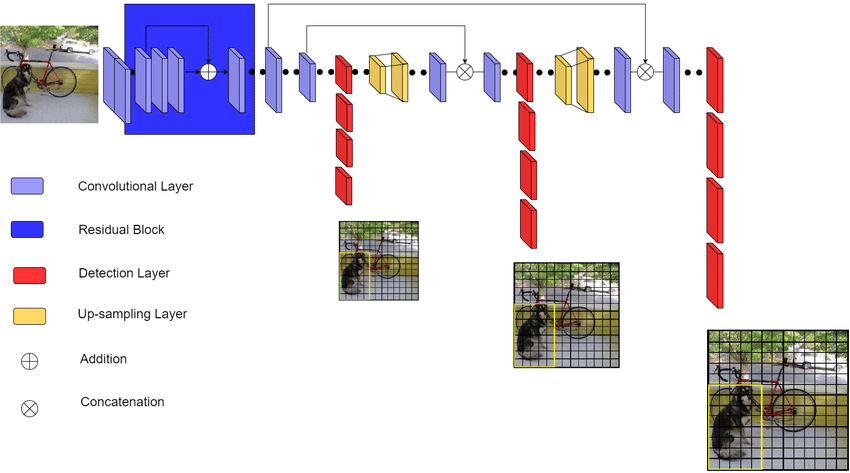

# Yolo-V3

This is a pytorch implementation of [Yolo V3](https://arxiv.org/abs/1804.02767), supported by pretrained weights for Pascal-VOC and inference script.

# Setup And Inference
Code is developed under following library dependencies
```commandline
python 3.7
torch 1.10.1
torchvision 0.11.2
opencv
```
Start with creating a virtual environment then open your terminal and follow the following steps:
```commandline
git clone "https://github.com/zaghlol94/Yolo-V3"
cd Yolo-V3
pip install -r requirements.txt
bash download_assets.sh
cd src
python detect.py -I "image path"
```
# Data-Set
This code we could use PASCAL_VOC or MS-COCO dataset
```commandline
├── images
│   ├── 000001.jpg
│   ├── 000002.jpg
│   ├── 000003.jpg
│   ├── .
│   ├── .
│   ├── .
│   └── 009963.jpg
├── labels
│   ├── 000001.txt
│   ├── 000002.txt
│   ├── 000003.txt
│   ├── .
│   ├── .
│   ├── .
│   └── 009963.txt
├── test.csv
└── train.csv
```
For each image ```*.jpg```  in images folder there is a corresponding text file ```*.txt``` in the same name. Every line in 
the text file represents an object. Every line contains five values, the first value is the class id and the last four value is the bounding box. bounding box style is either midpoint style or corner
```commandline
midpoint style example:-
11 0.34135977337110485 0.609 0.4164305949008499 0.262
```
## Train on custom data
prepare your data set as the same structure of Data-set that showed in the previous section, furthermore change the ```DATASET``` and
```NUM_CLASSES``` variables and add list contains the  classes name in [config.py](https://github.com/zaghlol94/Yolo-V3/blob/main/src/config.py), 
 then follow the following steps in the command line:
```commandline
cd src
python train.py
```
## Citation
```commandline
@article{yolov3,
  title={YOLOv3: An Incremental Improvement},
  author={Redmon, Joseph and Farhadi, Ali},
  journal = {arXiv},
  year={2018}
}
```